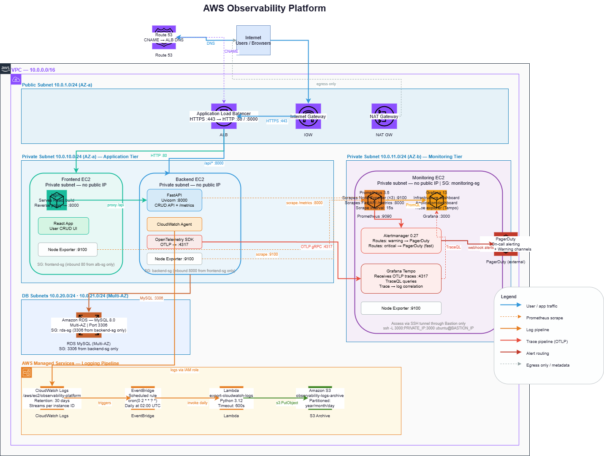

# AWS Observability Platform

A production-grade, end-to-end observability platform built on AWS, implementing the three pillars of observability — **Metrics**, **Logs**, and **Traces** — across a live multi-tier application.

Infrastructure runs in a private VPC with no services exposed directly to the internet. Traffic flows through an Application Load Balancer into private subnets, with strict Security Group rules enforcing least-privilege network access between every tier.

---

## Architecture



---

## Observability Pillars

| Pillar | Stack |
|--------|-------|
| **Metrics** | Node Exporter → Prometheus → Grafana |
| **Logs** | CloudWatch Agent → CloudWatch Logs → EventBridge → Lambda → S3 |
| **Traces** | OpenTelemetry SDK → OTLP Exporter → Grafana Tempo → Grafana |
| **Alerting** | Prometheus Alertmanager → PagerDuty |

---

## Project Structure

```
AWS-Observability-Platform/
├── app/
│   ├── backend/                  # FastAPI application (Python)
│   │   ├── main.py               # API routes, Prometheus instrumentation
│   │   ├── otel_config.py        # Tracing
│   │   ├── requirements.txt
│   │   └── .env.example
│   └── frontend/                 # React application
│       ├── src/
│       │   ├── App.js
│       │   ├── App.css
│       │   ├── index.js
│       │   ├── components/
│       │   │   ├── UserForm.jsx
│       │   │   └── UserTable.jsx
│       │   └── services/api.js
│       ├── public/index.html
│       ├── package.json
│       └── .env.example
├── monitoring/
│   ├── scripts/
│   │   ├── prometheus.sh         # Prometheus install + config
│   │   ├── grafana.sh            # Grafana install
│   │   └── node-exporter.sh      # Node Exporter install
│   │   └── alertmanager.sh       # Alert Manager install
│   └── alerting/
│       ├── alertmanager.yml      # Alertmanager routing config
│       └── alert-rules.yml       # Prometheus alerting rules
├── logging/
│   ├── cloudwatch-agent-config.json   # CloudWatch Agent config
│   ├── lambda-export-logs.py          # Log export Lambda function
│   ├── eventbridge-rule.json          # EventBridge schedule rule
│   └── README.md                      # Logging pipeline documentation
├── tracing/
│   ├── otel-config.py            # OpenTelemetry FastAPI instrumentation
│   ├── tempo-config.yaml         # Grafana Tempo configuration
│   └── README.md                 # Tracing pipeline documentation
├── architecture/
│   └── architecture.png
│   └── architecture.drawio
├── infrastructure/
│   ├── vpc.md                    # VPC, subnet, and routing design
│   ├── security-groups.md        # All Security Group rules
│   └── iam-roles.md              # IAM roles and policies
├── docs/
│   └── deployment-guide.md       # Step-by-step deployment instructions
├── screenshots/
│   ├── grafana-node-exporter.png
│   └── grafana-app-metrics.png
│   └── grafana-traces.png
│   └── cloudwatch-logstreams.png
└── README.md
```

---

## Infrastructure Design

### Network

- **VPC**: `10.0.0.0/16` — fully isolated private network
- **Public Subnet** `10.0.1.0/24`: Application Load Balancer only
- **Private Subnets** `10.0.2.0/24` · `10.0.3.0/24`: All EC2 instances, RDS
- **Internet Gateway**: attached to VPC; ALB uses it, no EC2 has a public IP
- **NAT Gateway**: allows private EC2s to reach the internet (package downloads) without exposure

### Security Groups

| Security Group | Inbound Rules | Purpose |
|----------------|---------------|---------|
| `alb-sg` | 80, 443 from `0.0.0.0/0` | Public HTTPS access |
| `frontend-sg` | 80 from `alb-sg` only | Nginx behind ALB |
| `backend-sg` | 8000 from `frontend-sg` only | FastAPI, no public access |
| `monitoring-sg` | 9090, 3000 from `bastion-sg` only | Prometheus, Grafana |
| `rds-sg` | 3306 from `backend-sg` only | MySQL, private only |
| `bastion-sg` | 22 from trusted IP/CIDR | SSH jump host |

### IAM

- **EC2 Instance Role** (`ec2-observability-role`): `CloudWatchAgentServerPolicy` — allows CloudWatch Agent on the backend EC2 to publish logs without storing credentials
- **Lambda Execution Role** (`lambda-log-export-role`): `logs:CreateExportTask`, `s3:PutObject` — minimum permissions for the log archival function

---

## Application

A three-tier CRUD application used as the observable workload:

- **Frontend**: React (Node.js 18), served via Nginx reverse proxy. Nginx handles static file serving and proxies `/api/*` requests to the backend — the browser never communicates directly with the backend EC2.
- **Backend**: FastAPI + SQLAlchemy. Exposes a `/metrics` endpoint via `prometheus-fastapi-instrumentator` for Prometheus to scrape. Handles user management (Create, Read, Update, Delete).
- **Database**: Amazon RDS MySQL, Multi-AZ, accessible only from the backend security group.

---

## Metrics

Prometheus scrapes three targets every 15 seconds:

| Target | Port | What it exports |
|--------|------|-----------------|
| Frontend EC2 (Node Exporter) | 9100 | CPU, memory, disk, network |
| Backend EC2 (Node Exporter) | 9100 | CPU, memory, disk, network |
| Backend EC2 (FastAPI) | 8000 | HTTP request rate, latency, status codes |
| Monitoring EC2 (Node Exporter) | 9100 | CPU, memory, disk, network |

Grafana dashboards visualise:

1. **Infrastructure dashboard** — Node Exporter Full (Grafana dashboard ID 1860)
2. **Application dashboard** — FastAPI HTTP metrics (request rate, p50/p95/p99 latency, error rate)

---

## Logging

```
Backend EC2
    │
    ▼ (unified CloudWatch Agent)
CloudWatch Logs
    │  Log group: /aws/ec2/observability-platform
    │  Log streams: {instance_id}
    ▼
EventBridge (scheduled rule: daily 02:00 UTC)
    │
    ▼
Lambda (export-cloudwatch-logs)
    │  Creates CloudWatch export task
    ▼
Amazon S3
    └── s3://observability-logs-archive/
            └── year=YYYY/month=MM/day=DD/
```

See [logging/README.md](logging/README.md) for full setup instructions.

---

## Tracing

OpenTelemetry SDK is instrumented directly inside FastAPI:

```
FastAPI request
    │
    ▼ (opentelemetry-instrumentation-fastapi)
OTel SDK (trace context, span creation)
    │
    ▼ (OTLP exporter, gRPC :4317)
Grafana Tempo
    │
    ▼
Grafana (Explore → TraceQL queries)
```

Trace IDs are correlated with logs via the `trace_id` field injected into every log line, enabling a single click in Grafana to jump from a slow trace to the corresponding log lines.

See [tracing/README.md](tracing/README.md) for instrumentation details.

---

## Alerting

Alertmanager routes alerts from Prometheus to PagerDuty:

| Alert | Condition | Severity |
|-------|-----------|----------|
| `InstanceDown` | Node Exporter unreachable for > 1m | critical |
| `HighCPU` | CPU > 85% for > 5m | warning |
| `HighMemory` | Memory usage > 90% for > 5m | warning |
| `HighErrorRate` | HTTP 5xx rate > 5% for > 2m | critical |
| `HighLatency` | p95 latency > 500ms for > 5m | warning |

---

## Tech Stack

**Application**: React · FastAPI · SQLAlchemy · Amazon RDS (MySQL)  
**Metrics**: Node Exporter · Prometheus 3.5 · Grafana 13  
**Logging**: CloudWatch Agent · CloudWatch Logs · EventBridge · Lambda · Amazon S3  
**Tracing**: OpenTelemetry Python SDK · Grafana Tempo · Grafana  
**Alerting**: Prometheus Alertmanager · PagerDuty  
**Networking**: VPC · ALB · Security Groups · NAT Gateway · IAM